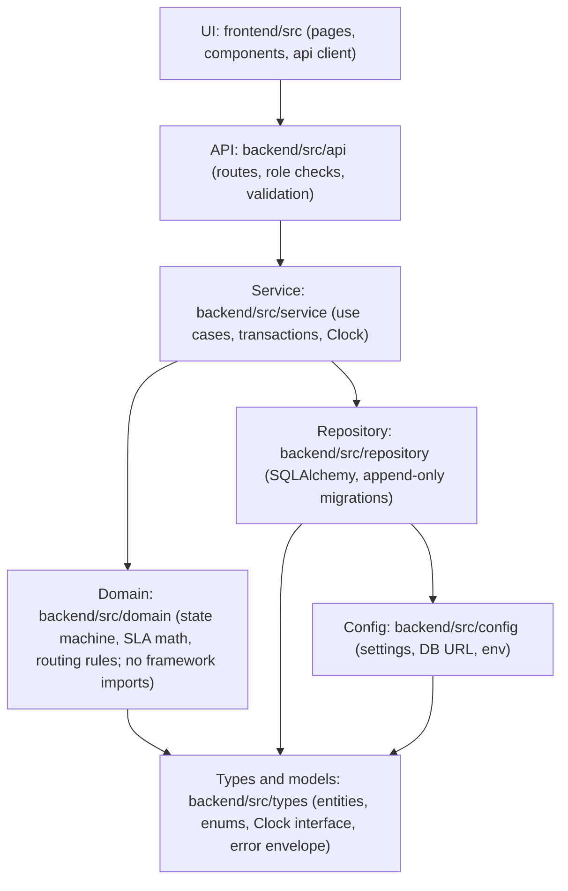
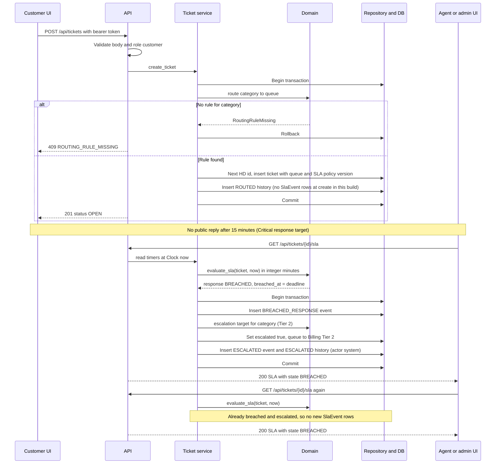

# Architecture (solo, minimal)

- Status: APPROVED

Full rules: `.claude/architecture.md`. Requirements: `specs/brd/brd.md` Section 8. Endpoints: `specs/design/api-contracts.md`. Entities: `specs/design/data-models.md`.

## Layers

Dependencies point downward only. A layer may import from the layers it points to, never from above. The arrow reads "may import from".

Rules that follow from the diagram:

- Domain rules live only in `src/domain`. They import Types only. import-linter forbids domain imports of `src.api`, `src.service`, `src.repository`, `fastapi` and `sqlalchemy`. `src.config` is not restricted by that contract.
- Services own transactions. Ticket insert and routing share one transaction (ASM-S7). Breach and escalation share one transaction.
- Controllers check roles (NFR-04). Services never trust a role passed without a check at the API layer.
- Only the router writes `queue_id` on create (NFR-08). No architecture test currently enforces this.
- SLA code uses integer minutes only, with no float type and no `/` division (NFR-01).
- Time comes from the injected Clock. No code calls the system clock directly, and no test sleeps.

## Sequence: ticket creation, SLA breach, escalation

No scheduler exists. Breach checks run on each ticket read or write (ASM-S8, `specs/escalation_spec.md`).

## Invariants checked by tests

- Closed tickets are immutable (NFR-08).
- Cross-customer reads return 404 (NFR-08).
- Routing cannot be bypassed (NFR-08).
- Append-only tables expose no update or delete method (NFR-02, NFR-05).
- Each timer produces at most one breach event and each ticket at most one ESCALATED event.

## Logging and PII (NFR-03, NFR-06)

- **Format.** Every log line is one JSON object: `timestamp` (UTC), `level`, `logger`, `message`, `correlation_id`, plus structured fields such as `method`, `path`, `status` and `duration_ms`. Set in `backend/src/config/logging_setup.py` from `LOG_LEVEL` (default `INFO`). uvicorn's loggers use the same handler; `uvicorn.access` is held at WARNING because the request line replaces it.
- **Correlation id.** `backend/src/api/correlation_middleware.py` reuses a well-formed incoming `X-Correlation-Id` or generates one, stores it in a context variable, and returns it on every HTTP response. The header is exposed to browsers through CORS.
- **Request line.** One `helpdesk.request` line per HTTP request with method, path (no query string), status and duration. Request and response bodies are never read or logged.
- **Redaction.** `backend/src/config/log_redaction.py` runs as a handler filter, so it covers every logger. It masks, in order:
  1. email addresses as `[REDACTED_EMAIL]`;
  2. phone numbers (10 to 15 digits with common separators) as `[REDACTED_PHONE]`;
  3. known names from `users.display_name` (full, first and last name, case-insensitive, whole words) as `[REDACTED_NAME]`;
  4. names after a greeting or sign-off (`Hi`, `Hello`, `Dear`, `Regards`, `Thanks`, ...) and after `my name is` or `I am`;
  5. `body`, `description`, `subject` and `title` fields on a record are replaced with `[REDACTED]`.
- **Ticket text.** Ticket subject and body reach a log line only through `log_ticket_content` in `backend/src/config/ticket_logging.py`. It redacts first and keeps at most 200 body characters.
- **Known names.** `refresh_known_names` (`backend/src/service/known_names_service.py`) loads names at startup. Call it again after any user row is added or renamed. The app has no create-user path yet, so nothing calls it at runtime.

**Known limit.** A free-text name is not masked when it is not in the users table and has no greeting, sign-off or "my name is" / "I am" pattern. For example, "Ask Oluwaseun about the refund" passes through unmasked. The name rules are deterministic and do not use an NER model, so they trade recall for predictability. Capitalised words in a greeting are masked unless they appear on the stop list in `log_redaction.py`.
