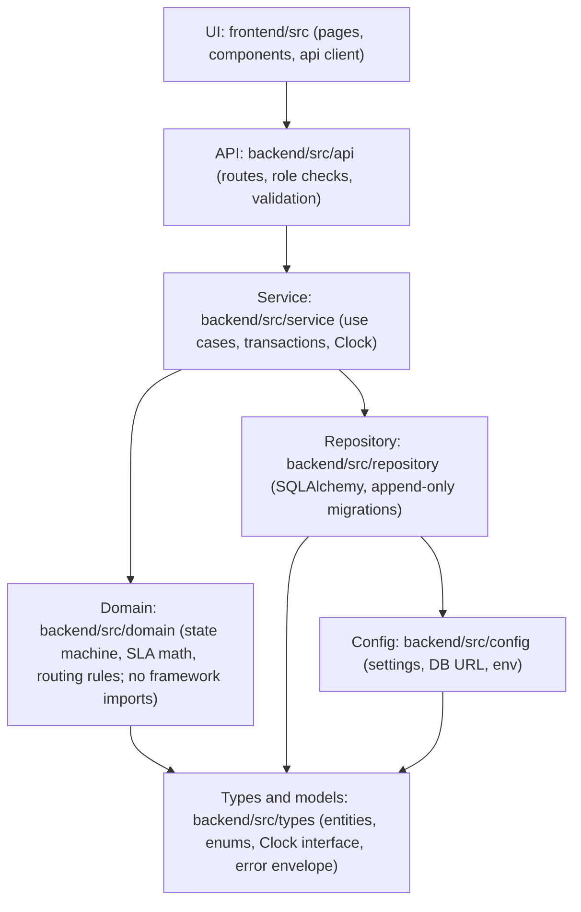

# Architecture (solo, minimal)

- Status: APPROVED

Full rules: `.claude/architecture.md`. Requirements: `specs/brd/brd.md` Section 8. Endpoints: `specs/design/api-contracts.md`. Entities: `specs/design/data-models.md`.

## Layers

Dependencies point downward only. A layer may import from the layers it points to, never from above. The arrow reads "may import from".

Rules that follow from the diagram:

- Domain rules live only in `src/domain`. They import Types, never FastAPI, SQLAlchemy or React.
- Services own transactions. Ticket insert and routing share one transaction (ASM-S7). Breach and escalation share one transaction.
- Controllers check roles (NFR-04). Services never trust a role passed without a check at the API layer.
- Only the router writes `queue_id` on create. An architecture test enforces this (NFR-08).
- SLA code uses integer minutes only, with no float type and no `/` division (NFR-01).
- Time comes from the injected Clock. No code calls the system clock directly, and no test sleeps.

## Sequence: ticket creation, SLA breach, escalation

No scheduler exists. Breach checks run on each ticket read or write (ASM-S8, `specs/escalation_spec.md`).

## Invariants checked by tests

- Closed tickets are immutable (NFR-08).
- Cross-customer reads return 404 (NFR-08).
- Routing cannot be bypassed (NFR-08).
- Append-only tables expose no update or delete method (NFR-02, NFR-05).
- Each timer produces at most one breach event and each ticket at most one ESCALATED event.
