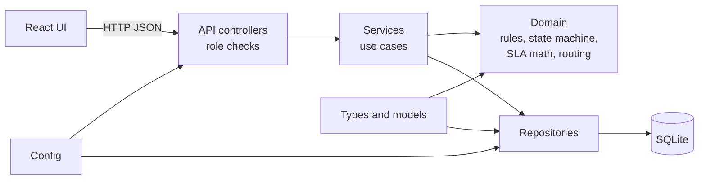

# Business Requirements Document — HelpDesk Pro

- Project: HelpDesk Pro (capstone BC-AINE-007)
- Status: APPROVED on 2026-10-03. `/spec` not yet run.
- Date: 2026-10-03
- Sources: capstone brief "AI-Native Engineer Capstone · BC-007 HelpDesk Pro" (Sections 3, 5, 6, 7, 8), existing `CLAUDE.md`, `project-manifest.json`
- Interview mode: answered from the capstone brief. Gaps are recorded as documented assumptions (Section 13). The open questions were resolved at approval (Section 14).

---

## 1. Executive Summary

HelpDesk Pro is a web-based support ticketing and SLA management platform for a B2B SaaS company. Customers file tickets through a web form. A rules-based routing engine places each ticket in a team queue (Billing, Technical, Account). Agents claim, reassign, annotate, and reply to tickets. Tickets move through an enforced status lifecycle. An SLA engine tracks response and resolution timers in integer minutes, and breaches escalate the ticket to a higher-tier queue. Agents publish resolved tickets as Knowledge Base (KB) articles. Admins manage versioned SLA policies per priority without code changes.

The product is also the vehicle for the capstone. Every line of production code, test, and migration must be generated by Claude Code agents under human supervision. The human acts as architect, spec author, and PR gatekeeper. The deliverable is a working platform plus an evidence trail of agent-led development.

## 2. Problem Statement

A B2B SaaS company receives customer issues at a volume that cannot be handled by email threads and spreadsheets. Without a shared system the company cannot:

- route each issue to the team that can resolve it, consistently and quickly,
- know which tickets are close to missing a response or resolution commitment,
- prove to customers and internal stakeholders that commitments were met or missed,
- keep solutions discovered during support work available to the next agent or customer,
- change service commitments (SLA targets) without a developer deploying code.

The capstone problem is the same, expressed as a build task: build the ticket lifecycle from intake to resolution (routing, queues, SLA timers, agent assignment, escalation, knowledge base) under one constraint. No production code may be written by hand.

## 3. Target Users

| Persona | Role (enforced) | Context of use | Primary goals |
|---|---|---|---|
| Customer (end user at a client company) | `customer` | Non-technical or semi-technical. Uses a web browser on desktop or mobile. Files issues and checks progress. | File a clear ticket fast, see status, answer requests for information, find existing answers first. |
| Support agent | `agent` | Works a queue all day in a desktop browser. Handles many tickets in parallel. | Pick up the right tickets, reassign when wrong, communicate internally and publicly, close the loop with a KB article. |
| Support admin | `admin` | Periodic use. Owns service commitments and team structure. | Set SLA targets per priority, manage teams and agents, review SLA performance. |

Each role is enforced at the controller layer (NFR-04). A customer sees only their own tickets (NFR-08).

## 4. Success Metrics

Metrics for the platform (measured against seed data and automated tests) and for the capstone (measured by the review rubric). Targets are proposed; see Open Questions for confirmation.

### 4.1 Product metrics

| # | Metric | Target | How measured |
|---|---|---|---|
| M1 | Acceptance criteria covered by passing AC-tagged tests | 10 of 10 (AC-01 to AC-10) | Test names contain AC id; CI report |
| M2 | Routing correctness on seed corpus | 100% of seed tickets land in the team mapped to their category | Automated routing test over seeded tickets |
| M3 | SLA timer accuracy | 0 floating-point operations in SLA arithmetic; timer values match expected integer minutes in 100% of unit cases | Static check (hook/grep) plus unit tests |
| M4 | Breach detection | 100% of seeded breach scenarios flip the ticket to ESCALATED and to the higher-tier queue | Unit and integration tests for AC-06 |
| M5 | Immutability of history | 0 UPDATE or DELETE paths on history, note, reply, assignment, and SLA event tables | Architecture test and repository review |
| M6 | Authorization | 0 cross-customer ticket reads and 0 role-boundary bypasses in the test suite | Role-boundary tests (NFR-04, NFR-08) |
| M7 | Coverage | At least 80% line coverage floor; 100% of AC ids have at least one test | Coverage artefact in CI |
| M8 | Time to first ticket | A new developer reaches a running app with seed data in under 10 minutes using the README quick-start | Timed dry run |
| M9 | Health endpoint latency | Returns 200 within 1 second of successful startup (NFR-07) | Automated check |

### 4.2 Capstone metrics

| # | Metric | Target |
|---|---|---|
| C1 | Rubric score | At least 75 (Merit) as a working target; 90 (Distinction) as a stretch |
| C2 | Hand-written production code | 0 lines, verified from git history of PRs and agent logs |
| C3 | PR-driven merges | At least 3 `--no-ff` merges to main; 0 direct commits to main |
| C4 | Effort | Completed within the 20-hour engagement budget |

## 5. Scope

### 5.1 In scope

Customer:
- Create a ticket with title, description, category, and priority (AC-01).
- List own tickets and view status and pending requests.
- Reply on a ticket (AC-08). Attachments are stubbed (metadata only, no storage).
- Search the KB before opening a ticket.
- Notifications are stubbed (recorded as events and shown in-app, no real email).

Agent:
- Agent workbench: queue with filters by priority, status, and SLA state (breached, at risk, on track).
- Claim and reassign tickets with immutable assignment history (AC-03).
- Change status through enforced transitions (AC-04).
- Add internal notes and public replies, both append-only (AC-07).
- Publish a resolved ticket as a KB article (AC-09).

Admin:
- Edit SLA policies per priority, with versioning and immutable published versions (AC-10).
- Manage teams and agents (create, activate or deactivate, assign membership).
- Reporting dashboard with a small fixed set of counts (open by queue, breached by priority, escalations in period).

System:
- Routing engine: rules map category to team queue (AC-02).
- SLA engine: response and resolution timers per priority, breach detection (AC-05, AC-06).
- Escalation handler: breach flags ESCALATED and moves the ticket to a higher-tier queue (AC-06).
- Structured JSON logs with request correlation ids and redaction of PII (NFR-03, NFR-06).
- Health endpoint (NFR-07).

### 5.2 Out of scope (capstone brief Section 6.3, adopted as written)

- Real email gateway or IMAP intake.
- Real-time chat or WebSocket conversations.
- Multi-channel intake. The web form is the only intake channel.
- Machine-learning routing or sentiment analysis.
- Real SSO or OAuth identity providers.
- Production deployment, secret management, multi-region.

### 5.3 Explicitly deferred (see Section 12 Future Considerations)

- Real file upload and storage.
- Real notification delivery.
- Multi-tenant organizations with shared visibility inside a client company (see A-04).
- SLA business-hours calendars. Timers run on wall-clock minutes.

## 6. MVP Definition

The MVP is the smallest slice that satisfies all ten acceptance criteria end to end, runs locally with one command, and has seed data. It is the capstone's minimum mandatory set.

MVP includes:
1. Ticket intake with auto-generated ID and OPEN state (AC-01).
2. Routing to Billing, Technical, and Account queues by category (AC-02).
3. Claim and reassign with immutable history (AC-03).
4. Enforced lifecycle OPEN, IN_PROGRESS, PENDING_CUSTOMER, RESOLVED, CLOSED (AC-04, AC-08).
5. Response and resolution SLA timers in integer minutes, breach flags ESCALATED and moves to a higher-tier queue (AC-05, AC-06).
6. Internal note and public reply, append-only (AC-07).
7. KB publish from a resolved ticket, KB CRUD restricted to agent and admin (AC-09).
8. Versioned SLA policy per priority, immutable once published (AC-10).
9. Role enforcement at the controller layer for customer, agent, admin (NFR-04).
10. Seed data (teams, agents, customers, sample tickets) and a README quick-start.

Deferred from MVP: dashboard charts (a table of counts is enough), notification delivery beyond recorded events, attachment storage, team and agent management beyond seed-driven setup if time runs short. Any deferral must be recorded in `features.json` before it happens.

## 7. Alternatives Considered

Chosen: Option A, Python FastAPI, SQLAlchemy, SQLite, and React with Vite. It matches `project-manifest.json` and `CLAUDE.md`, runs locally with one command, and gets layering and TDD checks from import-linter, mypy strict, and pytest.

Rejected: Option B, NestJS with PostgreSQL in Docker (setup friction and an extra layer-check tool). Option C, ASP.NET Core with Razor (weaker responsive and UI evidence, and a tooling mismatch with the Python and Node harness).

## 8. Technical Architecture

### 8.1 Layers (one-way dependencies, enforced by import-linter)

Types and models, then config, then repository, then service, then API, then UI. Business rules live in `src/domain` and have no dependency on FastAPI, SQLAlchemy, or React.

### 8.2 Components

- Backend API: FastAPI on uvicorn, port 8000. Exposes `/health` and the REST surface defined in `specs/design/api-contracts.md`.
- Frontend: React with Vite, port 5173. Role-aware views for customer, agent, and admin.
- Database: SQLite file for local runs, in-memory SQLite for tests.
- Migrations: append-only SQL files. A migration is never edited after it lands. SLA policy versions are rows, never updates.
- Logging: structured JSON, one line per event, with a correlation id per request. PII patterns (email, phone, and name fields in ticket bodies) are redacted before logging.
- SLA timer evaluation: timers are evaluated on read, through one domain function (for example `evaluate_sla(ticket, now)`) that tests call directly. There is no scheduled tick or background job. "Now" comes from the injected Clock (A-20).

### 8.3 Time and arithmetic

- All SLA quantities are integer minutes (NFR-01). Timestamps are stored in UTC. Elapsed minutes are computed as integer floor of seconds divided by 60 in the domain layer. No float type appears in SLA code.

## 9. Data Model Overview

Entities (detail in `specs/design/data-models.md`):

| Entity | Purpose | Mutability |
|---|---|---|
| User | Seeded identity with a role (customer, agent, admin) and optional team membership | Mutable profile, role changes recorded |
| Team | Queue owner (Billing, Technical, Account, plus higher-tier queues) | Mutable |
| Ticket | Customer issue: id, title, description, category, priority, status, current queue, customer id, assignee id, SLA deadlines | Mutable through services only |
| TicketHistory | Every status change with actor and timestamp | Append-only |
| Assignment | Each claim or reassign with actor, from, to, timestamp | Append-only |
| TicketNote | Internal note, not visible to customer | Append-only |
| TicketReply | Public reply, visible to customer | Append-only |
| SlaPolicy | Named policy version per priority with response_minutes and resolution_minutes | Append-only; a published version is immutable |
| SlaEvent | Timer start, breach, and escalation events | Append-only |
| RoutingRule | Maps category to target team | Mutable by admin. Plain rows, not versioned (A-07) |
| KbArticle | Title, body, tags, source ticket id | Create and update allowed for agent and admin; source ticket id fixed |
| Notification | Recorded notification event for a user | Append-only |

Identifiers: human-readable ticket id (for example `HD-000123`), generated by the service.

## 10. External Integrations

None in the capstone scope. Email, SSO, and file storage are stubbed (brief Section 6.3 and Section 6.1). Stubs must be behind an interface so a real adapter can replace them later without changing the service layer.

## 11. Edge Cases and Constraints

### 11.1 Ticket lifecycle

- Valid transitions are exactly:
  - OPEN to IN_PROGRESS (agent claims or starts work)
  - IN_PROGRESS to PENDING_CUSTOMER (agent requests information)
  - PENDING_CUSTOMER to RESOLVED (agent resolves after the customer responds)
  - RESOLVED to CLOSED (closure)
  - PENDING_CUSTOMER to OPEN (customer replies, AC-08)
  - IN_PROGRESS to RESOLVED (documented extension: agent resolves without a customer request; not in the brief's lifecycle list)
- Any other transition raises `InvalidTicketStateException` (AC-04). Examples: OPEN to RESOLVED directly, CLOSED to anything.
- CLOSED tickets cannot be mutated (NFR-08). Any write attempt is rejected.

### 11.2 SLA timers

- Response timer starts at ticket creation (AC-05) and stops at the first public agent reply (assumption A-02).
- Resolution timer starts at ticket creation and stops when the ticket reaches RESOLVED (AC-05). It keeps running through PENDING_CUSTOMER (assumption A-03).
- Breach occurs when elapsed integer minutes meet or exceed the policy value.
- A breach on either timer sets status flag ESCALATED and moves the ticket to the higher-tier queue for its category (AC-06). The lifecycle status is unchanged. ESCALATED is a flag, not a status, to keep the five lifecycle states intact (assumption A-05).
- A ticket escalates at most once per timer. Re-breach events are not duplicated.

### 11.3 Routing

- Every new ticket is routed at creation. A ticket cannot exist without a team queue (NFR-08: routing cannot be bypassed).
- Category to team mapping: Billing to Billing, Technical to Technical, Account to Account. An unknown category is rejected at intake with a validation error, so it never reaches the queue without a rule.
- Routing rules are admin-editable data rows, not code. Changes are not versioned (A-07).

### 11.4 Authorization

- Customer: create own ticket, read own tickets, reply on own tickets. No access to other customers' tickets, notes, or internal data.
- Agent: read all tickets in the queues, claim, reassign, change status through the state machine, add note and reply, publish KB articles.
- Admin: all agent permissions, plus SLA policy management, team and user management, and dashboard. Admin does not bypass the state machine or immutability rules.
- Enforced in controllers through dependencies, and tested with role-boundary tests.

### 11.5 Immutability and audit

- Append-only tables: TicketHistory, Assignment, TicketNote, TicketReply, SlaEvent, SlaPolicy versions, Notification (NFR-02, NFR-05).
- No UPDATE or DELETE on these tables in any code path. A hook or architecture test checks this.

### 11.6 Privacy

- Ticket bodies can contain emails, phone numbers, and names. These are redacted in logs (NFR-03). Stored data is synthetic only (brief Section 3.4).
- No real personal data, no Virtusa confidential data, and no customer-sensitive data are used anywhere in the repository.

### 11.7 Operational constraints

- Runs locally on a single machine. No uptime target beyond local availability.
- No rate limiting required for the capstone. Assumed out of scope (A-09).
- Budget: 20-hour engagement (brief Section 2).

### 11.8 Likely failure modes

| Failure | Handling |
|---|---|
| Invalid state transition requested | Raise `InvalidTicketStateException`, return 409 with a stable error code, no state change, log with correlation id |
| Unknown category at intake | Return 422, no ticket created |
| SQLite lock contention under concurrent claims | Optimistic version check on ticket update; second writer receives 409 |
| Repeated SLA evaluation of the same ticket | Timers computed from stored UTC timestamps on each read; evaluation is idempotent and each breach is recorded once |
| Agent tries to edit a closed ticket | Rejected by domain rule; attempt logged |
| Published SLA policy edit attempt | Rejected; admin must create a new version |
| Migration applied twice | Migration ledger prevents re-application |
| Customer requests another customer's ticket | 404 (no existence leak), audit log entry |

## 12. Future Considerations (not in this build)

Real email intake and notifications, WebSocket updates, business-hours SLA calendars, organization-level visibility (A-04), ML routing and sentiment, real SSO, attachment storage with malware scanning, and multi-region deployment.

## 13. Assumptions

These fill gaps the capstone brief does not answer. Each is reversible before `/spec`.

| ID | Assumption | Rationale |
|---|---|---|
| A-01 | Ticket categories are exactly Billing, Technical, Account. Each maps to a team of the same name. | Brief AC-02 requires at least these three. |
| A-02 | Response SLA stops at the first PUBLIC agent reply (AC-07 record). Claiming a ticket and adding internal notes do not stop it. | Brief does not define "response". A public reply is the customer-visible response. Approved. |
| A-03 | Resolution SLA keeps running while PENDING_CUSTOMER. It stops only at RESOLVED. | Literal reading of AC-05 ("continues until the ticket reaches RESOLVED"). |
| A-04 | Each customer is an individual account. Customers cannot see other customers' tickets, even from the same company. | NFR-08 and no tenancy in brief. Organization sharing is future work. |
| A-05 | ESCALATED is a flag plus queue move, not a lifecycle state. The five lifecycle states stay exact. | AC-04 lists exact states. AC-06 says "flags", not "transitions". |
| A-06 | Higher-tier queues are named by tier: "Billing Tier 2", "Technical Tier 2", "Account Tier 2". Escalation keeps the category. | Brief says "higher-tier queue" without naming. |
| A-07 | SLA policies are data rows, edited by admins and versioned (AC-10). Routing rules are admin-editable data rows and are not versioned. | Keeps SLA changes auditable. Routing rules stay simple. Avoids code changes for both. |
| A-08 | Auth uses seeded user accounts with bearer tokens issued at login. Passwords are hashed. No SSO. Demo credentials are documented in the README. | Project manifest says seeded-user tokens. Brief excludes real SSO. |
| A-09 | No rate limiting, no CSRF beyond token auth, no production hardening. | Brief Section 6.3 excludes production deployment. |
| A-10 | Default SLA values for seed data: Critical response 15 min, resolution 240 min. High 60 and 480. Medium 240 and 1440. Low 480 and 2880. | Brief does not give values. Admin can change them (AC-10). |
| A-11 | Priorities are Critical, High, Medium, Low. | Brief says "per priority" without listing levels. |
| A-12 | Ticket ids are human readable with prefix HD- and a zero-padded sequence. | Brief requires an auto-generated id. |
| A-13 | Timestamps stored in UTC. Timers use wall-clock minutes, no business hours. | Keeps SLA arithmetic integer and simple. |
| A-14 | Notifications are recorded as rows and shown in the customer or agent UI. No email is sent. | Brief says stubbed. |
| A-15 | Attachments are accepted as file name and size metadata only. No file bytes stored. | Brief says stubbed upload. |
| A-16 | Seed data includes 3 teams plus 3 tier-2 queues, 2 agents per team, 1 admin, 3 customers, and about 15 sample tickets across states. All synthetic. | Needed for demo and tests. |
| A-17 | A customer reply on a RESOLVED ticket is rejected. Reopen is not in scope. | Brief lists no reopen path. Keeps the state machine as specified. |
| A-18 | A customer reply on an OPEN or IN_PROGRESS ticket adds the reply without a state change. Only PENDING_CUSTOMER moves to OPEN. | Literal reading of AC-08. |
| A-19 | Dashboard shows counts in a table. No charts. | Brief lists a reporting dashboard. Charts are not required. |
| A-20 | Time comes from an injectable Clock interface, so tests advance time without sleeping. SLA clocks run 24x7 on wall-clock minutes. All SLA arithmetic is integer minutes. | Makes timer tests deterministic and fast. Supports NFR-01 and A-13. |

## 14. Open Questions

All five questions were resolved at approval on 2026-10-03.

1. Escalation topology (A-06): one tier-2 queue per category (Billing Tier 2, Technical Tier 2, Account Tier 2).
2. SLA stop rule (A-02): response SLA stops at the first PUBLIC agent reply only.
3. Tenancy (A-04): customers see only their own tickets.
4. Auth (A-08): seeded users with bearer-token login. Demo credentials are documented in the README.
5. SLA defaults (A-10): the seed values in A-10 are approved.

## 15. UI Context

- Responsive web app. Breakpoints: desktop at 1280 px and above (agent workbench), tablet at 768 px (customer and agent), mobile at 375 px (customer ticket list and reply). Required for brief Section 7.2 "at least one responsive layout".
- Primary screens:
  - Customer: sign-in, new ticket form, my tickets list, ticket detail with reply box, KB search.
  - Agent: workbench queue with filters (priority, status, SLA state), ticket detail with claim, reassign, status change, internal note, public reply, publish-to-KB action, KB list and editor.
  - Admin: SLA policy editor with version history, team and user management, dashboard table.
- Design references: none provided. Styling is simple and consistent. Visual polish is not graded (brief Section 2).
- Accessibility: WCAG 2.1 AA as a target for labels, focus order, and contrast. Not formally audited. Assumed.
- Snapshot tests: Playwright snapshot directory required (brief Section 7.4).

## 16. Acceptance Criteria Traceability

| Criterion | Requirement summary | BRD section |
|---|---|---|
| AC-01 | Create ticket, OPEN state, auto id | 5.1, 6, 9, A-12 |
| AC-02 | Category routing to 3 teams | 5.1, 11.3, A-01 |
| AC-03 | Claim and reassign, immutable history | 5.1, 9, 11.5 |
| AC-04 | Enforced lifecycle, InvalidTicketStateException | 11.1 |
| AC-05 | Response and resolution timers | 11.2, A-02, A-03 |
| AC-06 | Breach flags ESCALATED and moves to higher tier | 11.2, A-05, A-06 |
| AC-07 | Internal note and public reply, append-only | 5.1, 9, 11.5 |
| AC-08 | Customer reply moves PENDING_CUSTOMER to OPEN | 11.1, A-18 |
| AC-09 | KB publish, CRUD restricted to agent and admin | 5.1, 11.4 |
| AC-10 | Admin edits SLA policy per priority, versions immutable | 5.1, 11.2, A-07, A-10 |
| NFR-01 to NFR-08 | Non-functional requirements | 8, 11 |

## 17. Approval

Status: APPROVED on 2026-10-03 by the human. The approved changes are the lifecycle transitions (11.1), routing rules unversioned (A-07, Section 9), no scheduled SLA tick (8.2), the Clock assumption (A-20), and shortened Sections 7 and 12. `/spec` has not been run.
